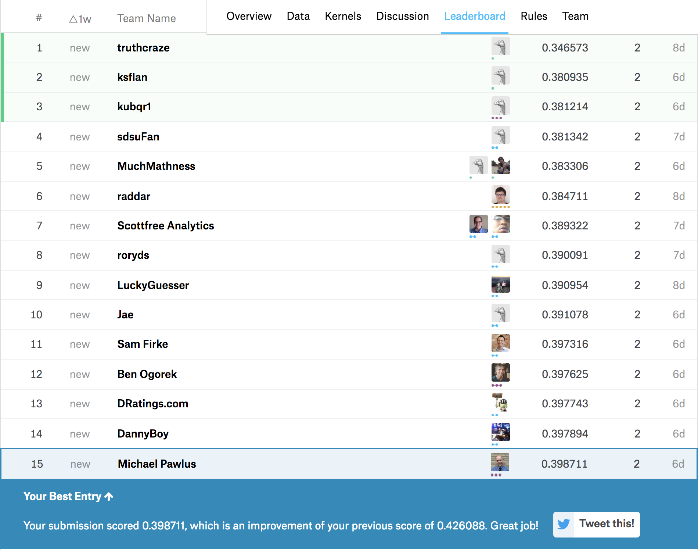

 
### Fine Margins
 
Let's start by stating that Burnley are having an incredible Premier League campaign. Clarets boss Sean Dyche is notable for using his post-match interviews to point out that the club's success has been decided by fine margins which is to say that many of their victories have been the result of outscoring the opposing team by a single goal. 
 
#### Just how fine are the margins?
 
After hearing this sentiment echoed consistently by the manager, I had the idea to look at a metric for evaluating just how fine the margins have been. While all goals are valuable, the goal that makes the total scored one greater than the other team is the most valuable. 
 
For people that don't follow this sport, 3 points are awarded for a win and 1 point for a draw  (As an American, saying the name of this sport is problematic and both options are sub-optimal). So, we can somewhat easily calculate the point value of every goal to compare Burnley's margins with the rest of the league.
 
#### Load the Data and Libraries
 
[Football Data UK]("http://www.football-data.co.uk") has an impressive amount of freely available data. We will load the results from the current Premier League season.
 


#libraries (we will do everything just using the tidyverse)
library(tidyverse)
 
# get data
epl <- read_csv("http://www.football-data.co.uk/mmz4281/1718/E0.csv")



## Warning: Missing column names filled in: 'X66' [66], 'X67' [67], 'X68' [68]



## Parsed with column specification:
## cols(
##   .default = col_double(),
##   Div = col_character(),
##   Date = col_character(),
##   HomeTeam = col_character(),
##   AwayTeam = col_character(),
##   FTHG = col_integer(),
##   FTAG = col_integer(),
##   FTR = col_character(),
##   HTHG = col_integer(),
##   HTAG = col_integer(),
##   HTR = col_character(),
##   Referee = col_character(),
##   HS = col_integer(),
##   AS = col_integer(),
##   HST = col_integer(),
##   AST = col_integer(),
##   HF = col_integer(),
##   AF = col_integer(),
##   HC = col_integer(),
##   AC = col_integer(),
##   HY = col_integer()
##   # ... with 9 more columns
## )



## See spec(...) for full column specifications.

 
#### Remove 0-0 draws
 
The objective of this exercise is to create a normalized value scale where the maximum value per goal would be 3 which is to say that a team wins every game by a score of 1-0. Given this, 0-0 draws need to be removed since these result in points being accumulated without goals being scored. If 0-0 draws were included then in theory a single goal could be valued at 40 points if 37 matches ended in 0-0 draws with just one 1-0 result.
 


# remove 0-0 draws by selecting only results where at least one team's goals are greater than 0
epl <- epl %>%
  filter(FTHG > 0 | FTAG > 0)

 
##### Stack the Results
 
Next, we will create summary tables for all possible results and stack these so we have one long dataset to use for plotting the value per goal metric.
 


home_wins <- epl %>%
  filter(FTR == "H") %>%
  select(HomeTeam, FTHG, FTR) %>%
  mutate(team = HomeTeam) %>%
  mutate(goals = FTHG) %>%
  select(-HomeTeam, -FTHG) %>%
  mutate(points = 3)
 
home_loss <- epl %>%
  filter(FTR == "A") %>%
  select(HomeTeam, FTHG, FTR) %>%
  mutate(team = HomeTeam) %>%
  mutate(goals = FTHG) %>%
  select(-HomeTeam, -FTHG) %>%
  mutate(points = 0)
 
away_wins <- epl %>%
  filter(FTR == "A") %>%
  select(AwayTeam, FTAG, FTR) %>%
  mutate(team = AwayTeam) %>%
  mutate(goals = FTAG) %>%
  select(-AwayTeam, -FTAG) %>%
  mutate(points = 3)
 
away_loss <- epl %>%
  filter(FTR == "H") %>%
  select(AwayTeam, FTAG, FTR) %>%
  mutate(team = AwayTeam) %>%
  mutate(goals = FTAG) %>%
  select(-AwayTeam, -FTAG) %>%
  mutate(points = 0)
 
home_draws <- epl %>%
  filter(FTR == "D") %>%
  select(HomeTeam, FTHG, FTR) %>%
  mutate(team = HomeTeam) %>%
  mutate(goals = FTHG) %>%
  select(-HomeTeam, -FTHG) %>%
  mutate(points = 1)
 
away_draws <- epl %>%
  filter(FTR == "D") %>%
  select(AwayTeam, FTAG, FTR) %>%
  mutate(team = AwayTeam) %>%
  mutate(goals = FTAG) %>%
  select(-AwayTeam, -FTAG) %>%
  mutate(points = 1)
 
goals_to_points <- bind_rows(
  home_wins, 
  home_loss, 
  away_wins, 
  away_loss, 
  home_draws, 
  away_draws
  )

 
##### Plotting the Metric
 
Lastly, we can plot our newly created metric using the proper club colors of course (thanks to: [Jim Nielsen]("http://jim-nielsen.com/teamcolors/"))
 


goals_to_points %>%
  group_by(team) %>%
  summarise(goals = sum(goals), points = sum(points), goal_point_value = points/goals) %>%
  mutate(team = fct_reorder(team, goal_point_value)) %>%
  ggplot(aes(y = goal_point_value, x = team, fill = team)) +
  geom_col() +
  coord_flip() +
  theme(panel.background = element_blank(), 
        panel.grid.major.y = element_line(color = "light grey", size = 0.25), 
        legend.position="none") +
  scale_fill_manual(values = c("#091453","#F7C240","#ED1A3B","#00A398","#EF0107","#0053A0","#E03A3E","#FBEE23","#1B458F","#E62333","#98C5E9","#001C58","#DBA111","#274488","#241F20","#F8BC1B","#0073D2","#000000","#DA020E","#8CCCE5")) + 
  labs(x = NULL, y = NULL, title = "Premier League Point Value Per Goal")


 
#### Dizzying Heights
 
Without the ability to pay the salaries that other teams pay, Burnley need to be as efficient as possible. Our plot shows that they have, in fact, far outpaced the rest of the league in value per goal. At one point in the season, Burnley were as high as fourth in the league table -- a position described as "dizzying heights" by many pundits. However, as of this post, Burnley have a real chance to finish in the Top 6 a segment of the league usually reserved for the same six teams every year. 
 
Also, as of this post, I am 15th in a Kaggle competition and if the results go my way for the remainder of the Women's NCAA Basketball Tournament I think I can finish "in the money" for the first time ever.  
 
 
  
 
  
Where will Burnley and I land? We will know before long...
